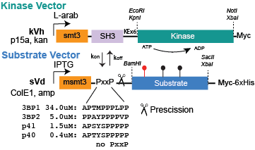
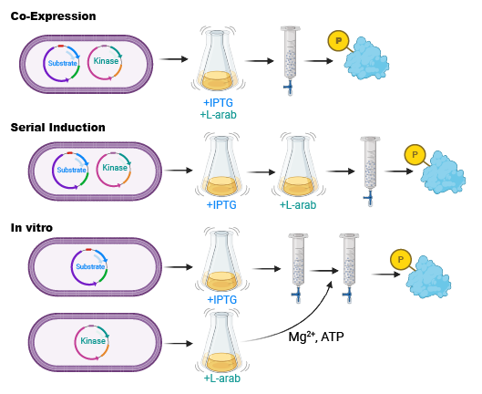

# Getting started with SISA-KiT

## What is SISA-KiT?
SISA-KiT (Signaling Inspired Synthetically Augmented Kinase Toolkit) is an approach that uses a domain-motif interaction to target a constitutively active tyrosine kinase to a substrate protein of interest to produce recombinant, tyrosine phosphorylated protein. In theory, any enzymatic interaction can replace the tyrosine kinase of interest and any protein target can be used. 

SISA-KiT requires two vectors, engineered to be co-transformed, independently selected, and independently induced in E. coli production systems. In theory, you can move the domain-enzyme fusion and motif-substrate components to any expression system! However, since E. Coli produces a large amount of protein very easily, all our documentation and vectors are currently focused on those systems. 

In the current SISA-KiT, targeting of the kinase to a substrate occurs between an SH3 domain (from ABL) and a polyproline sequence that SH3 domain recognizes. 

## How do I get started use SISA-KiT for making phosphoproteins?
It's very easy to get started! Our substrate vectors contain common cloning restriction sites and you select your vector(s), clone your substrate, screen for well performing reaction kinases, and optimize for specific product yield (including reaction types). You can order a starter kit of kinases and substrate vectors (14 total plasmids and additional substrate vectors from Addgene). Link pending. 

## What does a reaction look like in SISA-KiT?
We have three types of ways you can produce recombinant, phosphoprotein using SISA-KIT. These are referred to as co-expression, serial induction, and in vitro reactions. Where possible, we recommend using co-expression (simultaneously induce the substrate and kinase) which tends to produce larger yields of both protein and phosphoprotein. If you require phosphorylation occur after protein folding has occurred, you can use serial induction -- produce the subsrate protein first and then turn on the kinase. Finally, if you wish to couple kinases or move outside an E. coli system, you can use an in vitro approach -- make the substrate protein on its own and during the process of purification, resuspend the beads/matrix in kinase-expressing E. coli lysate supplemented in a magnesium- and ATP-rich buffer, then continue washing and elution as usual. 

## What does the kit contain? 
### Kinases
We have provided 9 kVh-vectors, SH3-fused tyrosine kinases from a wide variety of specifciities that express and perform well in recombinant E. coli systems. All kinases span the catalytic domain only, unless otherwise noted. The kVh system is a highly modified pBAD backbone, retaining L-arabinose based control of kinase induction, but with alternate origins of replication (p15a) and resistance selection (kanamycin), allowing them to be compatible with the substrate vector. These kinases include:
* [kVh-ABL (Addgene ID 259379)](https://www.addgene.org/259379/)
* [kVh-EPHB1 (Addgene ID 259380)](https://www.addgene.org/259380/)
* [kVh-EPHB2 (Addgene ID 259381)](https://www.addgene.org/259381/)
* [kVh-FES (Addgene ID 259382)](https://www.addgene.org/259382/)
* [kVh-FGFR3 (Addgene ID 259383)](https://www.addgene.org/259383/)
* [kVh-MERTK (Addgene ID 259384)](https://www.addgene.org/259384/)
* [kVh-EPHA4 (Addgene ID 259386)](https://www.addgene.org/259386)
* [kVh-LYN (contains LYN SH2 domain) Addgene ID 259385](https://www.addgene.org/259385/)
* [kVh-SRC (contains SRC SH2 domain) Addgene ID 259387](https://www.addgene.org/259387/)

### [Substrate vectors](SubstrateVectors.md)
We have made a variety of substrate vectors that provide the opportunity to use different fusions for the purpose of solubility, detection, purfication, or other purposes. All substrate vectors have induction control under lac-control (lactose/IPTG). We have two main substrate backbones in the toolkit, sVd - a highly modified pGEX (GST removed, and a tyrosine-free yeast sumo domain added for solubility) and a pET vector. All substrates include a MYC epitope and multi-His fusion for detection and purification and at least one version of a targeting sequence. Please note that your sequence may behave differently for production purposes, so we recommend cloning into a couple of substrate vectors to find the vector that is right for your sequence. 

#### Polyproline sequences defined
Binding affinity provided based on publication from [Pisabarro et al., JMB 1998](https://pubmed.ncbi.nlm.nih.gov/9698566/)
* p40:  APTYSPPPPP (0.4 &mu;M)
* p40F: APTFSPPPPP (p40 with tyrosine to phenylalanine mutation)
* p40W: APTWSPPPPP (p40 with tyrosine to tryptophan mutation)

#### Substrate vector options

|Addgene ID|Name|Selection|Backbone|Insert|N-terminal Fusion|C-terminal Fusion|5' Restriction Site|3' Restriction Site|
| --- | --- | --- | --- | --- | --- | --- | --- | --- |
|[259395](https://www.addgene.org/259395/)|[pETHF-PD1_Y223](Plasmid_files/substrates/pETHF-PD1_Y223.dna)|amp|pET|PD1 Y223 peptide|Halo(mod)-p40F-ABLmlinker|Fh8-StrepTagII-Myc-6xHis|EcoRI/BamHI|SacI/SacII/HindIII|
|[259393](https://www.addgene.org/259393)|[pETHG-PD1_Y223](Plasmid_files/substrates/pETHG-PD1_Y223.dna)|amp|pET|PD1 Y223 peptide|Halo(mod)-p40F-ABLmlinker|GB1-StrepTagII-Myc-6xHis|EcoRI/BamHI|SacI/SacII/HindIII|
|[259394](https://www.addgene.org/259394)|[pETSF-PD1_Y248](Plasmid_files/substrates/pETSF-PD1_Y248.dna) |amp|pET|PD1 Y248 peptide|SUMO2m-p40F-Linker2-p40F|Fh8-StrepTagII-Myc-6xHis|EcoRI/BamHI|SacI/SacII/HindIII|
|[259396](https://www.addgene.org/259396)|[pETSG-PD1_Y248](Plasmid_files/substrates/pETSG-PD1_Y248.dna)|amp|pET|PD1 Y248 peptide|SUMO2m-p40F-Linker2-p40F|GB1-StrepTagII-Myc-6xHis|EcoRI/BamHI|SacI/SacII/HindIII|
|[259388](https://www.addgene.org/259388)|[sVd-EGFRCtail](Plasmid_files/substrates/sVd-EGFRCtail.dna)|amp|sVd (pGEX mod)|EGFR Ctail|msmt3-p40|Myc-6xHis|BamHI/HindIII|SacII/SalI/XhoI/NotI|
|[259400](https://www.addgene.org/259400)|[sVdAlfa-PTPN11_NSH2](Plasmid_files/substrates/sVdAlfa-PTPN11_NSH2.dna)|amp|sVd (pGEX mod)|PTPN11 N_SH2|msmt3-p40-ALFATag|Myc-6xHis|BamHI|SacII|
|[259390](https://www.addgene.org/259390)|[sVdAvi-GAB1](Plasmid_files/substrates/sVdAvi-GAB1.dna)|amp|sVd (pGEX mod)|GAB1 Y627/Y659|msmt3-p40|AviTag-Myc-6xHis|BamHI|SacII/SalI/XhoI/NotI|
|[259391](https://www.addgene.org/259391)|[sVdAviW-GAB1](Plasmid_files/substrates/sVdAviW-GAB1.dna)|amp|sVd (pGEX mod)|GAB1 Y627/Y659|msmt3-p40W|AviTag-Myc-6xHis|BamHI|SacII/SalI/XhoI/NotI|
|[259392](https://www.addgene.org/259392)|[sVdpep-EGFR_ Y1172](Plasmid_files/substrates/sVdpep-EGFR_%20Y1172.dna)|amp|sVd (pGEX mod)|EGFR Y1172 21mer peptide|msmt3-p40W-GlyLinker|mutatedGST-Myc-6xHis|BamHI|SacI|
|[259389](https://www.addgene.org/259389)|[sVdW-EGFRCtail](Plasmid_files/substrates/sVdW-EGFRCtail.dna)|amp|sVd (pGEX mod)|EGFR Ctail|msmt3-p40W|Myc-6xHis|BamHI|SacII/XbaI|
|[259397](https://www.addgene.org/259397)|[sVf-PTPN11_NSH2](Plasmid_files/substrates/sVf-PTPN11_NSH2.dna)|amp|sVd (pGEX mod)|PTPN11 N_SH2|10xHis-msmt3|Myc-KExLinker-p40W|BamHI|SacII |
|[259398](https://www.addgene.org/259398)|[sVfAvi-PTPN11_NSH2](Plasmid_files/substrates/sVfAvi-PTPN11_NSH2.dna)|amp|sVd (pGEX mod)|PTPN11 N_SH2|10xHis-msmt3-p40W-KExLinker|Myc-KExLinker-AviTag|BamHI|SacII/NheI|
|[259399](https://www.addgene.org/259399)|[sVfAviWW-PTPN11_NSH2](Plasmid_files/substrates/sVfAviWW-PTPN11_NSH2.dna)|amp|sVd (pGEX mod)|PTPN11 N_SH2|10xHis-msmt3-p40W-KExLinker|Myc-KExLinker-p40W-AviTag|BamHI|SacII/NheI|

#### Tag definitions
For use in SISA-KiT we use tags, fusions, and components that are tyrosine free. We do this by selecting sequences with low to no tyrosines and replace tyrosines with non-phosphorylatable matches to phenylalanines. 

* msmt3 - the yeast sumo domain (smt3) where we have mutated all tyrosines to phenylalanines
* MYC - an epitope for detection (EQKLISEEDL) 
* 6xHis - a repeat of 6 histidines for use in purification using metal affinity chromotography.
* 10xHis - a repeat of 10 histidines for use in purification using metal affinity chromotograph, allows for increased stringency, compared to 6xHis.
* mutated GST (or GSTm) - the GST tag where all tyrosines are mutated to phenylalanines. This tag is used as an inert fusion to increase size for peptide vectors. GSTm does not work for puriciation. DNA was codon optimized for E. coli expression.
* ALFA-tag - 15 amino acid epitope tag that forms a stable alpha-helix for use in tagging, purification, or detection. The sequence is SRLEEELRRRLTE, DNA was codon optimized for expression in E. coli
* Halo-tag - the 33kDa Halo tag, used for protein labeling. 
* AviTag - for biotinylation, this 15 amino acid sequence (GLNDIFEAQKIEWHE) is selected by BirA ligase for site-specific biotinylation. 
* SUMO - this is the human SUMO2 sequence, where the two tyrosines are mutated to phenylalanines and the codons were optimized for E. coli production.
* Fh8 - for solubility, this sequence is: MPSVQEVEKLLHVLDRNGDGKVSAEELKAFADDSKCPLDSNKIKAFIKEHDKNKDGKLDLKELVSILSS. DNA was codon optimized for E. coli expression.
* GB1 - this 6kDa protein is extremly stable and excellent for increasing yield, all three tyrosines are mutated to phenylalanines. 

